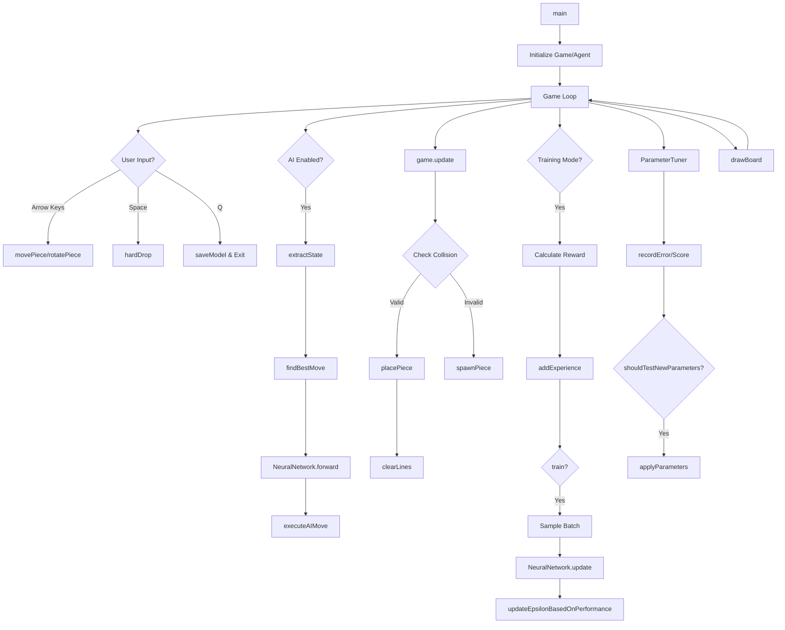

# Tetris AI - Complete Algorithm Diagram

## System Architecture Overview

```
┌─────────────────────────────────────────────────────────────────┐
│                         MAIN PROGRAM                             │
│                      (tetris.cpp::main)                          │
└────────────────────────────┬────────────────────────────────────┘
                             │
                ┌────────────┴────────────┐
                │                         │
        ┌───────▼────────┐      ┌────────▼────────┐
        │  TetrisGame    │      │    RLAgent      │
        │  (Game Logic)  │◄─────┤  (AI Learning)  │
        └───────┬────────┘      └────────┬────────┘
                │                        │
        ┌───────▼────────┐      ┌────────▼────────┐
        │  TetrisPiece   │      │ NeuralNetwork   │
        │  (Pieces)      │      │  (Q-Learning)   │
        └────────────────┘      └─────────────────┘
                                        │
                                ┌───────▼────────┐
                                │ParameterTuner  │
                                │ (Auto-tuning)  │
                                └────────────────┘
```

## Main Program Flow (tetris.cpp)

```
main()
│
├─► Parse Arguments (--model, --help)
│
├─► Initialize ncurses
│   └─► initColors()
│
├─► Create Game Objects
│   ├─► TetrisGame game
│   ├─► RLAgent agent(model_file)
│   └─► ParameterTuner tuner
│
└─► Game Loop (while true)
    │
    ├─► Handle Input (keyboard)
    │   ├─► Left/Right: movePiece()
    │   ├─► Up: rotatePiece()
    │   ├─► Down: Soft drop
    │   ├─► Space: hardDrop()
    │   ├─► A: Toggle AI
    │   ├─► T: Toggle training
    │   ├─► P: Pause
    │   └─► Q: Quit (saveModel())
    │
    ├─► AI Decision (if AI enabled)
    │   ├─► extractState() → state vector
    │   ├─► findBestMove() → best action
    │   └─► executeAIMove() → apply action
    │
    ├─► Game Update
    │   └─► game.update()
    │       ├─► Auto-fall pieces
    │       ├─► Check collisions
    │       └─► Clear lines
    │
    ├─► Training (if training mode)
    │   ├─► Calculate reward
    │   ├─► addExperience() → store in buffer
    │   ├─► train() → update network
    │   └─► updateEpsilonBasedOnPerformance()
    │
    ├─► Parameter Tuning
    │   ├─► recordError()
    │   ├─► recordScore()
    │   ├─► shouldTestNewParameters()
    │   └─► applyParameters() (if needed)
    │
    ├─► Save Model
    │   ├─► Every 100 episodes: saveModel()
    │   └─► On best score: saveModelToFile("best")
    │
    └─► Render
        └─► drawBoard() → display game state
```

## TetrisGame Class Methods

```
TetrisGame
│
├─► Constructor/Destructor
│   ├─► TetrisGame() → Initialize board, pieces
│   └─► ~TetrisGame() → Cleanup memory
│
├─► Piece Management
│   ├─► spawnPiece() → Create new piece
│   ├─► placePiece() → Lock piece to board
│   └─► clearLines() → Remove filled lines
│
├─► Movement & Rotation
│   ├─► movePiece(dx, dy) → Move left/right/down
│   ├─► rotatePiece() → Rotate clockwise
│   └─► hardDrop() → Instant drop
│
├─► Game Logic
│   ├─► update() → Main game loop step
│   ├─► checkCollision() → Check if move valid
│   └─► executeAIMove() → Apply AI decision
│
└─► State Analysis (for RL)
    ├─► getColumnHeight() → Height of column x
    ├─► countHoles() → Count empty cells below blocks
    ├─► calculateBumpiness() → Height differences
    ├─► getAggregateHeight() → Sum of all heights
    ├─► simulatePlacePiece() → Test piece placement
    └─► simulateClearLines() → Test line clearing
```

## TetrisPiece Class Methods

```
TetrisPiece
│
├─► TetrisPiece(type, x, y) → Constructor
├─► getShape() → Get 4x4 shape matrix
├─► rotate() → Rotate 90° clockwise
└─► getBlocks() → Get absolute block positions
```

## NeuralNetwork Class Methods

```
NeuralNetwork
│
├─► Initialization
│   └─► NeuralNetwork() → Xavier initialization
│
├─► Forward Pass
│   ├─► relu(x) → ReLU activation
│   └─► forward(input) → Compute Q-value
│       │
│       ├─► Hidden Layer
│       │   ├─► weights1 × input + bias1
│       │   └─► ReLU activation
│       │
│       └─► Output Layer
│           ├─► weights2 × hidden + bias2
│           └─► Return Q-value
│
├─► Backward Pass (Training)
│   └─► update(input, target, lr) → Gradient descent
│       │
│       ├─► Forward pass (store activations)
│       ├─► Calculate error = target - output
│       ├─► Clip error to [-10, 10]
│       │
│       ├─► Update Output Layer
│       │   ├─► Gradient clipping (max 1.0)
│       │   ├─► Weight decay (L2)
│       │   └─► Update weights2, bias2
│       │
│       └─► Update Hidden Layer
│           ├─► Gradient clipping (max 1.0)
│           ├─► Weight decay (L2)
│           ├─► ReLU derivative
│           └─► Update weights1, bias1
│
├─► Persistence
│   ├─► save(filename) → Write weights + header
│   │   └─► Includes timestamp & filename
│   └─► load(filename) → Read weights
│       └─► Skips header comments
│
└─► Statistics
    ├─► getWeightStatsString() → Format stats
    └─► logWeightChanges() → Log to file
```

## RLAgent Class Methods

```
RLAgent
│
├─► Initialization
│   └─► RLAgent(model_file) → Load or create network
│
├─► State Extraction
│   └─► extractState(game) → 29 features
│       ├─► 10 column heights (normalized)
│       ├─► Holes count
│       ├─► Bumpiness
│       ├─► Aggregate height
│       ├─► 7 current piece (one-hot)
│       ├─► 7 next piece (one-hot)
│       ├─► Lines cleared
│       └─► Level
│
├─► Decision Making
│   └─► findBestMove(game, training) → Best action
│       │
│       ├─► Epsilon-greedy exploration
│       │   ├─► Random (if ε > random)
│       │   └─► Greedy (otherwise)
│       │
│       └─► Evaluate all moves
│           ├─► For each rotation (0-3)
│           ├─► For each x position (0-9)
│           ├─► Simulate placement
│           ├─► Extract next state
│           ├─► Forward pass → Q-value
│           └─► Return best Q-value
│
├─► Experience Replay
│   ├─► addExperience(exp) → Store in buffer
│   │   └─► Remove oldest if full
│   │
│   └─► train() → Update network
│       │
│       ├─► Sample batch (32 experiences)
│       │   ├─► 80% recent experiences
│       │   └─► 20% old experiences
│       │
│       ├─► For each experience
│       │   ├─► Current Q-value: forward(state)
│       │   ├─► Next Q-value: forward(next_state)
│       │   ├─► Target = reward + γ × next_Q
│       │   ├─► Clip target to [-100, 100]
│       │   └─► update(state, target, lr)
│       │
│       └─► Adaptive learning rate
│           ├─► Reduce if error small & score high
│           └─► Clean buffer (remove excess game-over)
│
├─► Epsilon Management
│   └─► updateEpsilonBasedOnPerformance()
│       │
│       ├─► Baseline decay (slow)
│       ├─► Performance-based adjustment
│       │   ├─► Increase if score low & not improving
│       │   └─► Decrease faster if improving
│       └─► Track epsilon-score relationship
│
└─► Model Persistence
    ├─► saveModel() → Save to default file
    └─► saveModelToFile(filename) → Save to specific file
        └─► Includes metadata (epsilon, scores, etc.)
```

## ParameterTuner Class Methods

```
ParameterTuner
│
├─► Initialization
│   └─► ParameterTuner() → Create parameter sets
│
├─► Metrics Recording
│   ├─► recordError(error) → Track training error
│   ├─► recordEpsilon(epsilon) → Track exploration
│   └─► recordScore(score) → Track game scores
│
├─► Performance Evaluation
│   └─► evaluatePerformance() → Calculate metrics
│       ├─► Average error
│       ├─► Average score
│       ├─► Score improvement
│       └─► Error reduction
│
├─► Parameter Testing
│   ├─► shouldTestNewParameters() → Check if switch needed
│   │   ├─► Every 500 episodes
│   │   ├─► After 50 games minimum
│   │   └─► If performance degrades
│   │
│   ├─► getNextParameterSet() → Get next config
│   └─► applyParameters(params, agent) → Apply to agent
│
└─► Reporting
    ├─► generateReport() → Performance summary
    └─► resetForNewParameters() → Clear history
```

## Complete Function Call Flow

### Training Loop Sequence

```
1. main()
   │
   ├─► game.update()
   │   ├─► Auto-fall piece
   │   └─► Check game over
   │
   ├─► agent.findBestMove()
   │   ├─► extractState() → [29 features]
   │   ├─► For each move:
   │   │   ├─► Simulate placement
   │   │   ├─► extractState(next) → next_state
   │   │   └─► q_network.forward(next_state) → Q-value
   │   └─► Return best move
   │
   ├─► game.executeAIMove()
   │   ├─► Rotate piece
   │   ├─► Move to position
   │   └─► hardDrop()
   │
   ├─► Calculate reward
   │   ├─► Score difference
   │   ├─► Lines cleared
   │   ├─► Height penalty
   │   ├─► Holes penalty
   │   └─► Game over penalty
   │
   ├─► agent.addExperience()
   │   └─► Store (state, action, reward, next_state, done)
   │
   ├─► agent.train() (every batch)
   │   ├─► Sample 32 experiences
   │   ├─► For each:
   │   │   ├─► q_network.forward(state) → current_Q
   │   │   ├─► q_network.forward(next_state) → next_Q
   │   │   ├─► target = reward + γ × next_Q
   │   │   └─► q_network.update(state, target, lr)
   │   │       ├─► Forward pass (store activations)
   │   │       ├─► Calculate gradients
   │   │       ├─► Clip gradients
   │   │       ├─► Apply weight decay
   │   │       └─► Update weights & biases
   │   └─► Adaptive learning rate
   │
   ├─► agent.updateEpsilonBasedOnPerformance()
   │   └─► Adjust exploration rate
   │
   ├─► tuner.recordError()
   ├─► tuner.recordScore()
   └─► tuner.shouldTestNewParameters()
       └─► Apply new params if needed
```

### Model Save/Load Flow

```
Save:
  agent.saveModelToFile(filename)
    └─► q_network.save(filename)
        ├─► Write header (# Saved: timestamp, # Filename: name)
        ├─► Write weights1 (29×64)
        ├─► Write bias1 (64)
        ├─► Write weights2 (64×1)
        └─► Write bias2 (1)
    └─► Append metadata
        ├─► FILENAME
        ├─► EPSILON, EPSILON_MIN, EPSILON_DECAY
        ├─► LEARNING_RATE, GAMMA
        └─► TRAINING_EPISODES, TOTAL_GAMES, BEST_SCORE, etc.

Load:
  agent.RLAgent(model_file)
    └─► q_network.load(model_file)
        ├─► Skip header lines (# comments)
        ├─► Read weights1 (29×64)
        ├─► Read bias1 (64)
        ├─► Read weights2 (64×1)
        └─► Read bias2 (1)
    └─► Load metadata (if present)
        └─► Restore epsilon, scores, etc.
```

## Function Statistics

### By File

**tetris.cpp:**
- `main()` - Entry point
- `debugLog()` - Debug logging
- `drawBoard()` - Render game
- `initColors()` - Setup colors
- TetrisGame methods: 15 functions
- TetrisPiece methods: 4 functions

**rl_agent.cpp:**
- NeuralNetwork methods: 7 functions
- RLAgent methods: 7 functions

**parameter_tuner.cpp:**
- ParameterTuner methods: 8 functions

**Total: ~42 functions**

## Key Algorithms

### Q-Learning Update
```
Q(s, a) ← Q(s, a) + α × [r + γ × max Q(s', a') - Q(s, a)]
         │         │    │   │              │
         │         │    │   │              └─ Current Q-value
         │         │    │   └─ Discounted future value
         │         │    └─ Reward
         │         └─ Learning rate
         └─ Updated Q-value
```

### Epsilon-Greedy Exploration
```
if random() < epsilon:
    return random_action()
else:
    return argmax(Q(state, action))
```

### Experience Replay
```
1. Store (s, a, r, s', done) in buffer
2. Sample batch of experiences
3. For each experience:
   - Compute target Q-value
   - Update network toward target
```

### Gradient Descent (Backpropagation)
```
1. Forward pass: compute output
2. Calculate error: target - output
3. Backward pass:
   - Output layer gradients
   - Hidden layer gradients (via chain rule)
4. Update weights: w ← w - lr × gradient
5. Clip gradients and weights
```

---

## Visual Flow Diagram (Mermaid)



---

This diagram shows the complete architecture and flow of all functions in the Tetris AI system.

